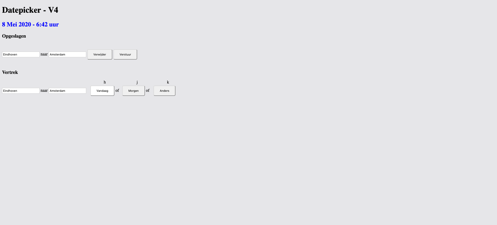
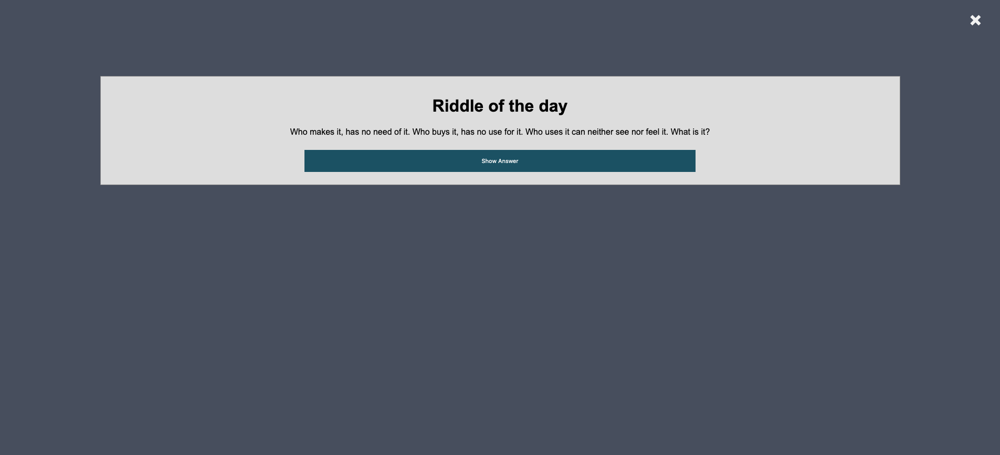
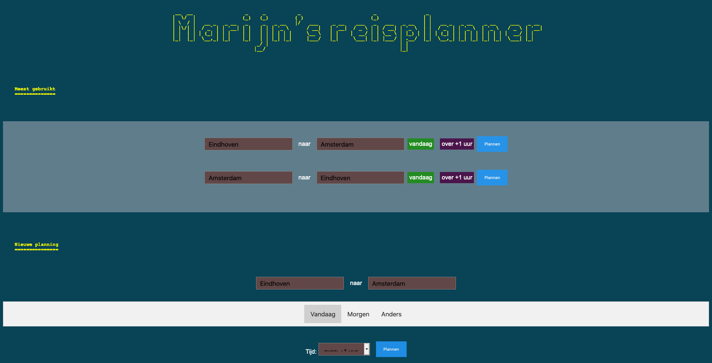

# Web Design @cmda-minor-web 1920

Live demo: https://randy554.github.io/web-design-1920/final2.html

## Introductie

Voor het vak [Web Design @cmda-minor-web 1920](https://github.com/cmda-minor-web/web-design-1920) had ik de opdracht gekregen om een passend concept te ontwikkelen voor een specifiek persoon. 
In mij geval was dat Marijn Meijles. Marijn is een programmeur met een motorische beperking. Om tot een passend en exclusief concept te komen voor Marijn, heb ik o.a. onderzoek, tests en iteraties op en voor het 
concept uitgevoerd. Het eindproduct is een customized NS-reisplanner die Marijn voornamelijk kan gebruiken om zijn reizen van en naar werk te plannen. Hieronder vindt je het eindproduct en de weg hier naar toe. 


## Installatie

```markdown
 
  #1. clone de repo
  https://github.com/randy554/real-time-web-1920.git

  #2. Navigeer naar de root van de app
  open web-design-1920

  #3. Bekijk site
  Open docs -> final2.html bekijk site: http://localhost:3006/

```
## Inhoud

* [Live demo](#Introductie)
* [Installatie](#Installatie)
* [User Scenario](#user-scenario)
* [Exclusive Design Principles](#exclusive-design-principles)
* [User Tests](#user-tests)
* [Overig Onderzoek](#overig-onderzoek)
* [Conclusie](#conclusie)
* [Bronnen](#bronnen)
* [Licentie](#licentie)


## User Scenario

`Marijn Meijles` is een programmeur, vader van twee kinderen en heeft een `motorische stoornis`. Marijn omschrijft zichzelf als een bedreven persoon.
Een analytisch persoon die een hekel heeft aan mensen die niet de tijd nemen om na te denken. Kwa humeur is hij meestal in een opgewekte stemming. 
Zijn voorkeur in muziek gaat uit naar metal. Dit is ook de reden waarom je hem tegen het lijf zou kunnen lopen bij Rockcity Eindhoven. 
Wat mij zelf opviel tijdens de eerste kennismaking is dat hij een goed gevoel voor humor heeft.

Door Marijn’s `motorische stoornis` gebruikt hij apparatuur zoals de pc en smartphone wat anders dan mensen die deze stoornis niet bezitten. 
Zo bedient hij zijn MacBook voornamelijk met `zijn linkerhand aan de rechterkant van het toetsenboard`. Hierbij maakt hij `zowel gebruik van toetsen als zijn trackpad`. 
De Tab toets gebruikt hij liever niet om te navigeren. Hiervoor maakt hij eerder gebruik van pijltoetsen om te navigeren. 
Verder is Marijn n het bezit van een iPhone en een MacBook Pro.  Op deze apparaten maakt hij voornamelijk gebruik van Google Chrome en Safari om te browsen.  

Marijn is naast vader van twee, CTO bij zijn bedrijf. Hij leidt een redelijk `druk bestaan`. Voor werk `reist hij vaak met de trein`. 
Bij het inplannen van deze reizen kan hij daardoor wel wat hulp gebruiken.  
Het idee is om een `persoonlijke NS reisplanner` voor Marijn te ontwerpen, waarbij de nadruk wordt gelegd op de date picker waarmee een reis gevonden kan worden. 


# Exclusive Design Principles

Geen goed product wordt ontworpen zonder de eindgebruiker in gedachten te houden en deze te proberen te begrijpen. 
Ditzelfde geldt ook voor het maken van websites/apps. Het probleem is dat designers vaak voor gebruikers als hunzelf ontwerpen maar niet voor mensen die heel anders omgaan met dezelfde producten. 
Om designers handvaten te bieden bij Exclusive Design heeft Vasilis van Germert vier principes ontworpen: Study situation, Ignore conventions, Prioritise identity en Add nonsense. 
Hieronder leg ik uit hoe ik deze principes heb toegepast binnen dit project.


### Study situation

> Je bestudeert de persoon zelf, in welke context de persoon jouw product gaat gebruiken en op welke wijze

Zoals eerder omschreven in [User scenario] is Marijn naast vader van twee ook CTO bij zijn bedrijf. Hij heeft een druk bestaan. 
Daarom zie ik het als passend om bij het ontwerpen van een oplossing uit te kijken naar mogelijkheden om de app efficiënt in gebruik te maken. 
Dit zie je bijvoorbeeld in de app terug bij ‘Meest gebruikte’ reizen, waarbij Martijn zijn meest recente reizen te zien krijgt en deze met klik kan plannen. 
Ook is dit doorgevoerd door middel van smart default, de reislocaties zijn van en naar zijn al ingevuld.

Zoals eerder aangegeven navigeert Marijn achter de pc ook anders dan de gemiddelde. Zo gebruikt hij de linker kant van zijn toetsenbord op de Mac liever niet. 
Hierdoor moet rekening gehouden worden dat een TAB-only navigatie via het keyboard niet handig is.

Marijn moet naast zijn reguliere werkreizen ook de mogelijkheid hebben om andere dagen reizen te kunnen plannen. 
Dit is mogelijk in de app via de ‘Anders’ menu-item.

### Ignore conventions

> De meeste huidige conventies waar designers zich aan houden werken niet voor mensen met een beperking. Er moet dus na het bestuderen van de person gekeken worden of het nuttig is om bepaalde conventies aan te houden.

Reguliere date pickers geven gebruikers standaard de mogelijkheid om alle toekomstige tijden en datums in te stellen. 
In Marijn’s geval is dit niet de ideale manier om hiermee om te gaan. Doordat Marijn hulp krijgt aan station, is hij gelimiteerd in wanneer hij moet aangeven dat hij in een bepaalde trein zit. 
In zijn geval minimaal een uur van tevoren. Ik heb er daarom voor gekozen om alleen relevante inputwaardes te weergeven per scenario. 
Zo kan hij bijvoorbeeld onder menu item ‘Vandaag’ alleen aangeven om over 1 of 2 uur te vertrekken.

Zoals bij study situation is aangegeven, gebruikt Marijn de Tab toets liever niet en kan hier dus niet alleen op de standaard tab navigatie worden gebouwd. 
Daarom zijn de elementen ook zonder Tab te navigeren met de pijltoetsen.

Verder slaat de focus de navigatie boven in over om vervolgens direct naar de eerste invoerveld te gaan.

### Prioritise identity

> Het eindproduct is voor Marijn specifiek bedoeld en niemand anders. Daarom is het belangrijk om zijn ideeën, mening/voorkeuren tijdens het ontwikkelen mee te nemen. Zo kom je tot nieuwe en relevante openbaringen.  

Het is dus van belang dat het einddoel samen met Marijn wordt behaald. Dit wordt binnen dit project uitgevoerd door wekelijks ideeën in de vorm van een prototype voor te stellen, te observeren en feedback hierop te vragen.

Marijn gaf aan dat hij gebruik maakt van zijn linkerhand om het rechterdeel van zijn toetsenbord te bedienen. 
En dat hij liever geen gebruik maakt van de TAB-toets om te navigeren. Ook vertelde hij dat hij gebruik maakte van sticky keys. 
Hierdoor kon ik de navigatie bruikbaar voor hem maken door de toets combinatie shift + de pijltoetsen te gebruiken als navigatie door het formulier.

Marijn had aangegeven dat hij als programmeur gebruikt maakt van de Vim-code editor. Hierdoor had ik het idee gekregen om de site in de stijl van Vim editor te stylen. 

Voor dit onderdeel heb ik vooral gekeken naar Marijn als persoon. Met name zijn achtergrond in techniek en zijn goede gevoel voor humor. 
Dit heeft geresulteerd in editor styling van de datepicker en de ‘riddle of the day’ content. Beide zijn door hem heel goed ontvangen. 

### Add nonsense

> Websites/apps ontwerpen voor mensen met een beperking is voor veel designers vaak onbekend terrein. Door hier en daar ‘onzinnige’ dingen toe te voegen aan een concept kun je tot interessante ideeën komen.

Vaak ook niet en dat is niet per se erg, het is ook gewoon leuk om af en toe iets anders te doen binnen een project. 
Het eerdergenoemde ‘riddle of the day’ valt ook onder dit kopje. 
Hoewel het in de laatste test heel goed werd ontvangen, gaf Marijn na het vragen van feedback hierover aan dat de positie misschien verplaatst kan worden omdat het misschien in de weg kan zitten als hij echt haast heeft. 
Dat is zeer terecht met de content waarmee er getest werd. Maar hoe zit dit met content die als herinnering kan dienen? 
Ik had dit met meer tijd willen testen.
 
Verder ben ik met de ‘nonsense’ verder gegaan binnen de context van de editor styling. Door velden waar er aanpassingen gemaakt kunnen worden, wordt bij hover de cursor verandert in een Vim editor cursor. 

# User Tests

<details>

<summary>Test week 1 (8 April) </summary>

#### Wie is Marijn Meijles)

Marijn is een programmeur, vader van twee kinderen en heeft een motorische stoornis. Marijn omschrijft zichzelf als een bedreven persoon. Een analytisch persoon die een hekel heeft aan mensen die niet de tijd nemen om na te 
denken. Kwa humeur is hij meestal in een opgewekte stemming. Zijn voorkeur in muziek gaat uit naar metal. Dit is ook de reden
waarom je hem tegen het lijf zou kunnen lopen bij Rockcity Eindhoven. Wat mij zelf opviel tijdens de eerste kennismaking is dat hij
een goed gevoel voor humor heeft.   

#### Testsessie
Op 8 April om 16:00 uur had mijn groep en ik een kennismakingsgesprek met Marijn Meijles. Voorafgaand hadden wij
gezamenlijk een aantal vragen bedacht die wij relevant achtte. Om meer inzicht te krijgen hadden wij ook naar de gekeken van studenten van vorig jaar. 


Verder hadden wij als groep één prototype die door Marijn getest moest 
worden. Ook hadden wij één persoon aangewezen die al onze vragen via de webcam & mic ging stellen. In het begin van het 
gesprek werden er vragen gesteld om Marijn als persoon beter te leren kennen. Dit waren vragen als hoe hij zichzelf zou 
omschrijven, wat hij in zijn vrije tijd doet en wat zijn voorkeur in muziek is. Na dit werden er vragen gesteld over zijn
gebruik van apparatuur en software. Zo gaf hij aan gebruik te maken van een MacBook en een iPhone XR die draaien op 
OS X en iOS. Ook gaf hij aan voornamelijk gebruik te maken van Google Chrome en Safari, en dat hij voor 
testdoeleinde bereid was om andere browsers te installeren. Hierna volgde er vragen die over hij op dit moment navigeert
op websites. Hierbij vertelde Marijn dat hij veel gebruik maakte van zijn `linkerhand aan de rechterkant van het toetsenbord. 
Hij maakt hier voornamelijk gebruik van de HJKL en pijltoetsen om te navigeren. Ook gaf hij aan weinig gebruik te maken van de TAB toets maar in plaats
daarvan de Spacebar Toets. Ook gaf hij aan gebruik maakt van sticky keys (hierbij blijft een toets ingedrukt totdat er
een vervolg toets wordt ingedrukt).

Na dat we door al onze vragen heen waren, ging we verder met het testen van de prototype. De prototype bestond uit zes verschillende
date & timepickers. Daarbij observeerde wij hoe Marijn met de verschillende input types omging, zowel op de site en webcam. Een
opvallende bevinden was dat hij toch wel meer gebruik maakt van de trackpad dan dat hij eerder aangaf in het interview. Zolang
de targets groot genoeg waren was dit minder een probleem om hier gebruik van te maken. Een ander bevinding was dat er niet
altijd goede feedback was na het uitvoeren van een handeling of dat er geen toelichting stond bij die input waardoor de opdracht
af en toe onduidelijk kon zijn.    

**Bevindingen**

-	Marijn is papa van twee 
-   Marijn is CTO bij zijn bedrijf
-   Marijn leidt een druk bestaan
-   Marijn woont in Eindhoven en werkt in Amsterdam 
-	Favoriete muziekgenre is metal
-	Schrikt niet snel van een technische uitdaging
-	Gebruikt Google Chrome/Safari op Apple devices (MacBook/IPhone).
-	Marijn gebruikt voornamelijk zijn linkerhand aan de rechterkant van het toetsenbord
-	Maakt het meest gebruik van `HJKL` -en `pijltoetsen`, zijn trackpad en sticky keys.

#### Hoe ging de test

Begin van de test hadden we wat problemen om Marijn te verstaan. Dit werdt veel beter toen hij van
plek veranderde. Het werken met Jitsi was niet echt een probleem voor Marijn, hij kon vrij makkelijk de mic gebruiken en zijn
scherm delen. Het was jammer dat wij zijn handen niet konden zien bewegen op het toetsenbord en trackpad. Het prototype
was op zich een goed idee. Het idee was om Marijn met verschillende datepickers te laten werken en dit te observeren. Helaas was onze prototype
niet helemaal goed getest waardoor bepaalde onderdelen niet helemaal naar behoren werkte. Voor de volgende keer zou het handig 
zijn als:

- er een extra camera aanwezig zou zijn die zijn handbewegingen op het toetsenbord en trackpad kan vastleggen
- de prototype volledig getest wordt op fouten voor gebruik
- tijdens de prototype test gebruik gemaakt kan worden van screenrecording
- tijd voor handelingen in de gaten gehouden kan worden

</details>


<details>

<summary>Test week 2 (15 April) </summary>

Uit test 1 kwamen een aantal grote `bevindingen` naar voren, namelijk:

-	Marijn is papa van twee en een drukke CTO
-	Favoriete muziekgenre is metal
-	Schrikt niet snel van een technische uitdaging
-	Gebruikt Google Chrome/Safari op Apple devices (MacBook/IPhone).
-	Marijn gebruikt voornamelijk zijn linkerhand aan de rechterkant van het toetsenbord
-	Maakt het meest gebruik van `HJKL` -en `pijltoetsen`, zijn trackpad en sticky keys.


Met deze bevindingen stelde ik mijzelf deze vraag: 

> *Hoe kan Marijn a.d.h.v. zijn voorkeur voor navigeren een datepicker op een efficiënte en prettige manier invullen?*

Na wat deskresearch & brainstormen eindigde ik met deze schets voor het prototype:


Het prototype was zo ontworpen om efficiënt te zijn. Dit vertaalde zich in het ontwerp door het elimineren van elementen die niet relevant zijn in de context waarin Marijn deze zou gaan gebruiken. 
Een voorbeeld hiervan is dat er geen jaartal ingevoerd hoefde te worden. Ook zijn er weer knoppen toegevoegd om ditzelfde doel te bereiken zoals het toevoegen van de ‘Morgen knop. 
Met deze knop is het mogelijk om met een handeling de volgende dag te selecteren.

##### Datepicker V1
 

##### Datepicker V2 


Hierbij was de dagen invoerveld vervangen met daadwerkelijke dagen van de week, zodat Marijn hiervoor niet zelf dag associaties hoefde te maken.  
Ook werd de tijden veld vervangen met over +1,2,3 uur selectieveld. Het idee hierachter was om hem zo snel mogelijk tijd te kunnen laten aangeven. 
Dus over 1,2 uur boven op de huidige tijd in plaats van dit per uur en minuut aan te geven. 
Marijn kon trouwens ook alleen een uur van tevoren aangeven aan de NS in welke trein hij zat om zo opgehaald te kunnen worden.

**Testplan**

Ik wil Marijn in het begin uitleggen wat het concept is. Daarna wil ik Marijn door een soort A/B test laten lopen. 
Deze bestaat uit 2 soortgelijke sites. De één is meer gericht op het navigeren met de trackpad en de ander meer gericht op het gebruik van bepaalde keys.

````text
Ik wil bij beide Marijn een opdracht geven en observeren hoe dit verloopt.

Voor observatie
* Hoe lang duurt dit ongeveer?
* Gaat hij in een keer naar de juiste buttons/input?
* Waar heeft hij moeite mee?

Eventuele vragen
* Is het gebruik van de app te volgen?
* Wat vindt u van de navigatie via de speciale keys?
* Wat vindt u van de layout van de app? 
* Heeft u nog tips, opmerkingen of toevoegingen voor deze app?  
````

**Bevindingen**

De werking van de app was niet helemaal te volgen. Dit kwam onder andere doordat alle opties in een keer getoond werden. 
De “over 1 uur” knop was verwarrend. De knop was in de context van vandaag een goede toevoeging maar niet voor de planning van morgen. 
De speciale keys voor de velden was handig maar ook weer verwarrend. De HJKL toetsen die aan de input velden en buttons was meegegeven waren voor Marijn verwarrend omdat de HJKL toetsen vanuit de VI editor als pijltoetsen dienen en hier was dat niet het geval. 
Ook was het concept waarvoor de datepicker gebruikt werd niet helemaal duidelijk. Dit moest ik expliciet uitleggen want er stond alleen ‘datepicker’ bovenaan de pagina. 
En bij de input velden stond er alleen het bijschrift ‘vertrek’.
Verder gaf Marijn ook aan dat hij standaard op maandag 09:30 van Eindhoven naar Amsterdam reist.
Hij heeft af en toe ook aparte reizen die hij maakt zoals af en toe zit hij in een hotel. Dus hier moet ook rekening mee worden gehouden dat hij niet alleen op standaard dagen tijden reist. 
Dus alleen een default is niet voldoende.

**Relevante observaties en feedback bij test van collega’s**

* Knoppen en andere elementen hoeven niet overdreven groot gemaakt te worden voor minder travel, hij irriteert zich hier eerder aan. 

* Sommige van de velden waren foutgevoelig zoals text input velden

**Hoe ging de test:**

Tijdens de test had ik last van internetproblemen. 
De test verliep hierdoor allesbehalve naar behoren. Ik kon hierdoor Martijn niet verstaan en hij mij ook niet. 
Hierdoor kon ik niet meteen het regie nemen met de test zoals ik dat had gepland. 
Het gevolg hierdoor was dat hij alvast van start ging en scenario’s ging uitproberen die ik niet per se had voorbereid. 
Hierdoor werden er wel fouten ontdekt zoals invoerwaardes die niet helemaal logisch waren in een bepaalde context. 
Gelukkig was er achteraf nog de ruimte om de test rustig doorlopen met Martijn en hem hierdoor te kunnen observeren en vragen op feedback.  

De tests als groep deed naar mij gevoel over het algemeen best wel lang. Ik denk dat dit een combinatie was van dat we niet een goed overzicht hadden van wie er allemaal nog aan de beurt moest komen en hoelang de test zou gaan duren. 

Voor de volgende keer zou het handig zijn als:

* Na het live gaan test of je audio/spraak en overige dingen het goed doen.
* Zorg dat de elementen die je in je prototype gebruikt goed werkend zijn of geeft dit bij voorbaat aan.
* Presenteer een overzicht met alle deelnemers aan de test in volgorde en hoeveel tijd iedere test ongeveer gaat/mag duren.

</details>

<details>

<summary>Test week 3 (22 April) </summary>

**De test**

De test met Marijn begon weer stip om 16:00 uur. Vasilis had na feedback van vorige week weer de moeite gedaan om bij Marijn op locatie te gaan en de test op te zetten. De test ging naar mij gevoel beter dan vorige week (test 2). Vooral vlotter naar mijn gevoel. Mensen waren tijdig aanwezig, het opzetten van de test verliep sneller en ook verliepen de gesprekken sneller naar mij gevoel. Ik kreeg het idee dat mensen beter wisten wat ze wilde weten. 

**Iteratie prototype 1**

Uit de voorgaande test kwam vooral naar voren dat de context waarin bepaalde elementen zich bevonden niet altijd helemaal duidelijk waren voor Marijn. 
Hierdoor heb ik het concept omgegooid en een ander benaderingen genomen om opties te kunnen presenteren aan Marijn.
Mijn grootste uitdaging was dus om de knoppen in juiste context te plaatsen. Dit was mijn eerste poging om dit voor elkaar te krijgen:

[Datepicker](https://randy554.github.io/web-design-1920/datepicker4.html)



Hoewel dit een vooruitgang was op de vorige versie, kwam ik na feedback van een collega-student achter dat dit nog steeds visueel verwarrend kon zijn.
Ook werkte het technisch niet helemaal naar behoren. En uit de vorige test had ik geleerd dat het beste handig is dat wat je laat zien wel werkt. 
Ik ben daarom opnieuw begonnen (Ziet iteratie prototype 2 voor het resultaat). 

**Testplan**

 
Uit de test wil ik graag zien of Marijn de context snapt van de opties die worden gepresenteerd. Ik wil kijken of Marijn zijn weg kan vinden bij het plannen van een reis. Ik wil kijken of Marijn redelijk snel kan navigeren. Verder wil ik wat Marijn van het concept ‘riddle of the day’ vindt. Ook wil ik weten wat Marijn van de code editor layout vindt. 

````text
Introductie

*    Hoe gaat het? 
*    Klaar voor test? 
*    Uitleg gang van zaken test.

Disclaimer

*    Aangeven data is niet realtime.

Opdrachten


*    Je zit in Amsterdam en je wilt over 1 uur een trein hebben naar Eindhoven.

*    Je wilt morgen om 7 uur van Eindhoven naar Amsterdam een reis hebben.

Vragen

*	Je gaf de vorige keer aan dat input velden onder ‘Vandaag’, ‘Morgen’ en ‘Anders’ niet helemaal in context was en daarom onduidelijk of niet passend. Is dat nu wel beter?

*	Is de ‘Morgen’ optie nog relevant aangezien de ‘Anders’ opties ook beschikbaar is? 

*	Wat vindt je van de ‘Raadsel van de dag’? Staat hij als pop-up goed of zou je deze liever ergens anders willen zien?

*	De formulieren onder de kopjes ‘Meest gebruikt’ en 'Nieuwe planning' staan nu standaard uitgeklapt, zou je dit zo willen houden of standaard één kopje willen dicht geklapt hebben?

*	Zou je behoefte hebben aan de optie om uit verschillende thema kleuren voor de layout te kunnen selecteren?

*	Zijn er nog andere verbeteringen of ideeën die je mist en toegevoegd zou willen zien?

````
**Iteratie prototype 2**

##### Pop-up met een dagelijkse raadsel



##### Prototype


**Bevindingen**

Marijn gaf aan dat hij de context van de inputvelden nu wel duidelijk vond. Dit viel mij zelf ook eerder op toen ik hem de opdrachten gaf om uit te voeren.  
Zo wist hij bij opdracht 1 meteen dat het handiger was om het formulier onder ‘Meest gebruikt’ te gebruiken. Ook onder het formulier van ‘Nieuwe planning’ wist hij zich goed te navigeren. 
Opvallend was wel is dat hij hier in tegenstelling tot het ‘Meest gebruikt’ formulier na het invullen van het tijdstip niet de planning knop in één keer aanklikte. 
Ik vermoed dat dit mogelijk zou kunnen komen omdat het hier om een select input ging in plaatst van een tekst input. Een mogelijke iteratie hierop zou kunnen zijn dat na het selecteren van een waarde, er direct de resultaten worden getoond. 
Dit zou uiteraard getest moeten worden. Verder gaf hij aan dat voor Morgen niet alle tijden beschikbaar waren. 
Dit klopt dit was een fout van mij. Dat bepaalde tijden expliciet disabled waren had ik over het hoofd gezien. 
Marijn gaf verder aan dat de ‘Morgen‘ optie met de aanwezigheid van de ‘Anders’ optie nog steeds relevant was om te behouden in het ontwerp. 
Dit bevestigt het nut voor Marijn om opties te bieden onder verschillende context. 

Marijn was erg enthousiast over de code editor layout met name de titel van de reisplanner. 
Wel gaf hij aan dat het kleurcontrast van de input tekstvelden wellicht beter konden. Ook gaf Marijn aan dat het niet nodig was om één van de formulieren standaard te verbergen om mogelijk meer overzicht te realiseren op de pagina. 
Ik had zelf ook geobserveerd dat hij redelijk snel van de ‘Meest gebruikt’ naar de ‘Niewe planner’ formulier navigeerde. Verder heeft Marijn niets aangegeven over de eventuele toevoeging van toetsen als aanvulling op de huidige navigatie. 
Marijn vond het idee van de ‘riddle of the day’ wel leuk maar, gaf ook aan dat hij dit liever op een andere plek zou willen terugzien. Als hij snel een treinrit wil zoeken wil hij niet dat dit in de weg zit. 


**Relevante observaties en feedback bij test van collega’s**

*	HJKL toetsen niet goed geïmplementeerd waardoor er irritatie en verwarring ontstond bij Marijn.

*	Tester had alleen toetsenbord als navigatie, Marijn gaf aan dat hij ook gebruik maakt van zijn trackpad.

*	Marijn gaf aan dat gekozen toets voor een handeling lastig is omdat hij hier waarschijnlijk vaak per ongeluk naast zal slaan. 

*	Marijn gaf aan dat elke actie minder is beter is. Onnodige wizard bij prototype van tester.


**Verbeteringen na Test 3**

*	Kleurencontrast inputvelden aanpassen
*   Toetsenbord controls
*	Popup verplaatsen 

**Final prototype 3**


</details>


# Conclusie

<details>

<summary>Conclusie </summary>

Dit was een zeer leerzame vak. Uit voorgaande vakken heb ik wel eerder eindgebruikers mogen observeren,
testen en interviewen. Toch was dit wel een hele andere ervaring. Dit product moest voor één specifiek
persoon ontwikkelt worden en dus niet voor een doelgroep. Dat betekent dus geen gemiddelde/globale aannames 
maar een meer persoonlijk begrip van de persoon voor wie je ontwikkelt. Ik begrijp nu beter waarom het 
betrekken van de eindgebruiker in dit geval alleen maar meer belangrijk is `(prioritise identity)`.

Een ander nieuwe ervaring is dat de persoon waarvoor het concept ontworpen moest worden, een motorische
stoornis heeft. Hierdoor is het wat lastiger om terug te vallen op eerdere ervaringen en moet je dus de 
context en doelen van de gebruiker goed proberen te begrijpen. Zo kon ik  mij niet goed voorstellen
welke input device Marijn gebruikte om zijn pc te navigeren.

Binnen dit project hebben wij in een relatief korte tijd een werkend concept moeten ontwikkelen. Tussen
het begin en einde van het project hebben wij meerdere concepten moeten voorleggen aan onze eindgebruiker.
Met het voornaamste doel om onze concepten te valideren en te verbeteren. Ik heb geleerd in dit project 
dat omdat je relatief weinig tijd had en pogingen had om concepten te testen bij de eindgebruiker, dat
je vooraf goed voor ogen moet hebben wat je geleerd hebt en wat je wil testen. En dit liever fijn en klein kunt 
houden. Dit geeft je de mogelijkheid om die ene feature dan beter te testen en door te itereren. Ook technisch 
gezien kun je het het beste lean houden en niet de moeilijkste weg moet gaan kiezen.

Testen op afstand was voor mij ook nieuw. Zoals ik eerder had vermeld had ik bij een test last van technische
problemen. Terwijl het vlak daarvoor niks aan de hand was. Gelukkig was dat later wel hersteld maar, 
dat geeft gelijk wel aan hoe afhankelijk je van de techniek bent. Marijn is zelf technisch onderlegd dus
dat wel mooi meegenomen bij het gebruiken van programma's als Jitsi en testen van prototypes. Ook hadden
wij veel hulp ontvangen van Vasilis :-). Hij hielp bij het opzetten en begeleiden van de test, zoals het opzetten 
van de webcam waardoor we de handbewegingen van Marijn konden volgen. Een ander belangrijk inbreng was het
herhalen van Martijn zijn commentaar. Die kon soms onduidelijk zijn.

Ik ben uiteindelijk wel positief over het eindresultaat. In week 2 van testen kreeg ik te horen dat van
Marijn dat mijn prototype niet volgbaar was. Ik heb toen een aantal keer moeten itereren om tot het prototype
te komen van week 3. Hier was hij weer helemaal enthousiast over. Achteraf gezien heeft de kritische feedback in 
week 2 mij goed geholpen om punten die ik over het hoofd zag weer te herkennen. 

</details>

# Overig onderzoek

<details>

<summary>Constrast checker & Color picker</summary>

Toen Marijn in test week 3 aangaf dat de achtergrondskleuren van de invoervelden niet zo goed zichtbaar waren, had ik 
door middel van deskresearch nieuwe kleuren geselecteerd en deze getest op contrast met een aangeranden tool van `W3C`. 


Color picker


</details>

<details>

<summary>VI Themes</summary>

Voor het stylen van de pagina heb ik door middel van deskresearch inspiratie op gedaan bij bestaande themas van de Vim editor.

Theme 1


Theme 2


</details>

Wishlist
------
- Error handeling
- Show results on changed input
- Realtime NS api
- Riddle of the day social media share
 
# Bronnen

 * [Modal](https://www.w3schools.com/howto/howto_css_delete_modal.asp)
 * [Tabs](https://www.w3schools.com/howto/howto_js_tabs.asp)
 * [Colour Contrast Check](https://snook.ca/technical/colour_contrast/colour.html#fg=FFFFFF,bg=01161E)
 * [Coolors](https://coolors.co/084356-01161e-598392-aec3b0-eff6e0)
 * [W3C Contrast](https://www.w3.org/TR/UNDERSTANDING-WCAG20/visual-audio-contrast-contrast.html)
 * [Flaticon](https://www.flaticon.com/home)

 

<!-- Add a link to your live demo in Github Pages 🌐-->

<!-- ☝️ replace this description with a description of your own work -->

<!-- replace the code in the /docs folder with your own, so you can showcase your work with GitHub Pages 🌍 -->

<!-- Add a nice poster image here at the end of the week, showing off your shiny frontend 📸 -->

<!-- Maybe a table of contents here? 📚 -->

<!-- How about a section that describes how to install this project? 🤓 -->

<!-- ...but how does one use this project? What are its features 🤔 -->

<!-- Maybe a checklist of done stuff and stuff still on your wishlist? ✅ -->

<!-- How about a license here? 📜 (or is it a licence?) 🤷 -->


